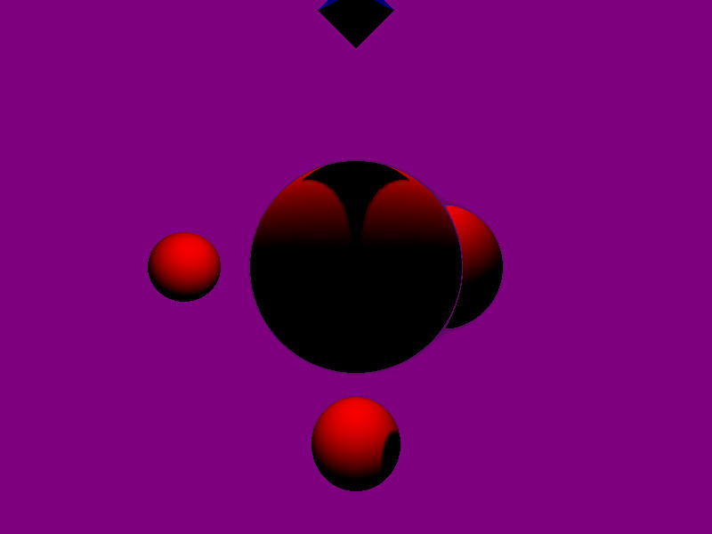

# RaymarchingRust
Implementación de raymarching en lenguaje Rust. Forma parte del proyecto para implementar un motor básico en diversos 
lenguajes (por el momento y en el repositorio : Python, Go y Rust). Algunas implementaciones están más avanzadas que otras, por lo que las funcionalidades pueden diferir.

Algunas de sus funcionalidades son :

Objetos :
  - Esfera.
  - Caja (cubo).
  - Octaedro.

Ruido procedural (usando la librería noise)
  - Perlin.
  - Worley.
  - OpenSimplex.
  - Multifractal Hybrid.

Sombras
    - Implementación de sombra suave según idea de Íñigo Quílez.

Niebla
    - Implementación de niebla volumétrica según idea de Íñigo Quílez.

  

Algunos enlaces de referencia (la información de los mismos es propiedad de sus respectivos autores) :

https://www.scratchapixel.com/lessons/3d-basic-rendering/ray-tracing-generating-camera-rays/generating-camera-rays

https://www.iquilezles.org/www/articles/distfunctions/distfunctions.htm

http://viclw17.github.io/2018/11/29/raymarching-algorithm/

https://www.iquilezles.org/www/articles/rmshadows/rmshadows.htm

https://iquilezles.org/www/articles/fog/fog.htm
